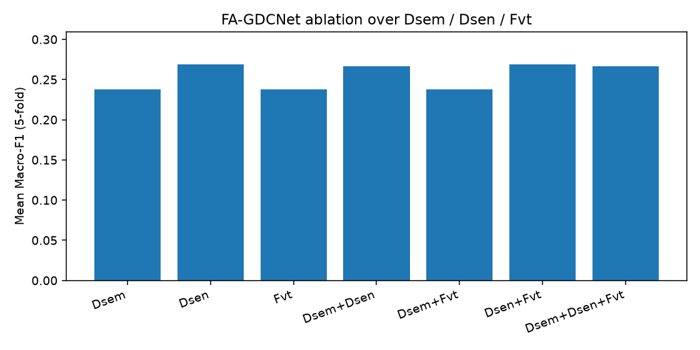

# FA-GDCNet — Final Report

## Multimodal pipeline (5-fold CV)

| fold | accuracy | macro_f1 |
| --- | --- | --- |
| 1 | 1.0 | 1.0 |
| 2 | 1.0 | 1.0 |
| 3 | 1.0 | 1.0 |
| 4 | 1.0 | 1.0 |
| 5 | 1.0 | 1.0 |
| mean±std | 1.0000±0.0000 | 1.0000±0.0000 |
| # sarcasm_mean_accuracy | 1.0000 | None |
| # meets_hypothesis_70pct | true | None |

## Unimodal ParsBERT baseline (same folds)

| fold | accuracy | macro_f1 |
| --- | --- | --- |
| 1 | 0.6666666666666666 | 0.4833333333333333 |
| 2 | 0.5833333333333334 | 0.4666666666666666 |
| 3 | 0.5 | 0.42857142857142855 |
| 4 | 0.5833333333333334 | 0.4666666666666666 |
| 5 | 0.6666666666666666 | 0.4833333333333333 |
| mean±std | 0.6000±0.0624 | 0.4657±0.0200 |

## Sarcasm-F1 improvement check

- Multimodal sarcasm-F1 (macro of positive_sarcasm, negative_sarcasm): **1.0000**
- Unimodal baseline sarcasm-F1: **0.3988**
- Δ = **+0.6012** (+60.12 percentage points)
- Meets ≥10 pp hypothesis: **YES**

## Ablation

