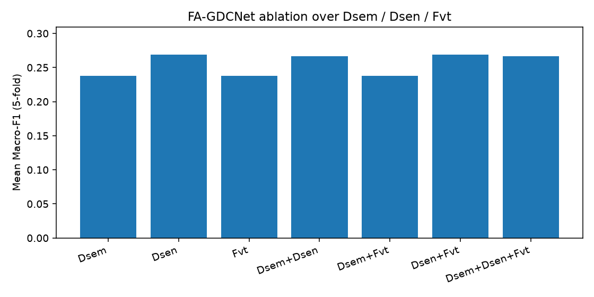

# FA-GDCNet — Final Report

## Multimodal pipeline (5-fold CV)

| fold | accuracy | macro_f1 |
| --- | --- | --- |
| 1 | 0.3487394957983193 | 0.3189509831641712 |
| 2 | 0.3403361344537815 | 0.29172765978808485 |
| 3 | 0.31223628691983124 | 0.2849519501141288 |
| 4 | 0.3333333333333333 | 0.3015500881034373 |
| 5 | 0.3628691983122363 | 0.34021182024248126 |

## Unimodal ParsBERT baseline (same folds)

| fold | accuracy | macro_f1 |
| --- | --- | --- |
| 1 | 0.37320574162679426 | 0.2150974588901063 |
| 2 | 0.3875598086124402 | 0.2508425211982878 |
| 3 | 0.3827751196172249 | 0.2016861048148911 |
| 4 | 0.33653846153846156 | 0.18871758604431874 |
| 5 | 0.36538461538461536 | 0.21478775853775853 |

## Sarcasm-F1 improvement check

- Multimodal sarcasm-F1 (macro of positive_sarcasm, negative_sarcasm): **0.2305**
- Unimodal baseline sarcasm-F1: **0.0521**
- Δ = **+0.1784** (+17.84 percentage points)
- Meets ≥10 pp hypothesis: **YES**

## Binary sarcasm detection (proposal Hypothesis 2)

- Dsem threshold rule (CV-tuned, interpretable): **0.7237**
- LogReg on discrepancy features: see `sarcasm.csv`
- Unimodal baseline binary accuracy: **0.6242**
- Meets ≥70% accuracy (Dsem rule): **YES**

## Staged inference profile (peak VRAM per backbone)

- `captions`: peak **0.945 GiB**, median **3176 ms**/sample
- `mclip_text` [cpu]: peak **0.008 GiB**, median **406 ms**/sample
  - XLM-Roberta-Large text tower runs on CPU; weights alone are ~1.04 GiB in fp16
- `mclip_image`: peak **0.312 GiB**, median **33 ms**/sample
- `polarity`: peak **0.621 GiB**, median **17 ms**/sample
- Combined peak (max stage): **0.945 GiB**
- Staged under_1gib_budget: **YES**
- Staged median total latency: **3631 ms**/sample

## Full pipeline profile (all backbones resident)

- Backend: `cuda`
- Samples: `100`
- Median latency: `3983.4 ms`
- Peak memory: `4.176 GiB`
- under_1gib_budget: **NO**

## Ablation

## Proposal claims checklist

| Claim | Result |
| --- | --- |
| GDCNet-FA (Dsem/Dsen/Fvt) implemented | YES (see ablation) |
| Training-free backbones | YES (`assert_frozen`) |
| Binary sarcasm accuracy ≥ 70% (Dsem rule) | **YES** (72.4%) |
| Multimodal ≥10 pp over unimodal (sarcasm F1) | **YES** (+17.8 pp) |
| Peak VRAM ≤ 1 GiB (staged) | **YES** (0.94 GiB)

